# B部分：多维结构的全景分析 —— 教育、经验、行业与地区的综合重塑

## 摘要

人工智能的崛起正在以"结构性"的方式重塑全球就业格局。
它并非简单地取代人类劳动，而是在教育、经验、行业与地区之间，
重新分配价值、风险与机会。

本部分首先从**教育与经验**切入，揭示个体在AI时代的生存逻辑；随后从**行业与地区层面**出发，描绘AI扩散带来的结构性差异； 接着进一步
展示了**教育与行业的交叉效应**，指出AI如何打破旧有的匹配秩序；
而尾声，则将这些分析凝聚为一个主题：AI不是摧毁工作，而是在重塑"工作"的结构。

------------------------------------------------------------------------

## 第一部分：教育与经验的结构分析（B1）

面对这场结构性重塑时，教育与经验，是个体最根本的支撑。
它们像一副"盔甲"------不是用来抵挡时代，而是让人能在风暴中继续前行。
在这副盔甲中，教育是坚实的钢板，经验是灵活的关节。
二者共同决定了一个人能否在被取代与被提升之间，找到立足之地。

------------------------------------------------------------------------

### （1）教育水平与自动化风险

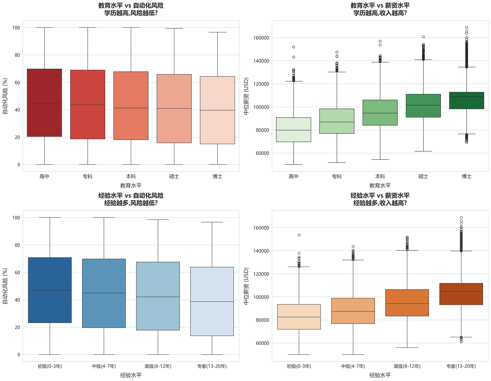

AI 的扩散，让"学历"不再只是求职的门槛，而成为抵御技术替代的防线。  
图表显示，随着教育层级的提升，平均自动化风险整体呈下降趋势，  
但这一下降并非线性。平均来看，教育层级每上升一级，  
风险大约下降 **2.7 个百分点**，而从高中到博士累计约下降  
**4.97 个百分点**。更加关键的是，这一下降幅度本身在收窄：  
博士相对于硕士的额外防护，已经不如硕士相对于本科的防护明显，  
这暗示教育的边际保护力正在减弱，AI 正在逐步“压平”高学历之间的护城河。

与此同时，教育提升也显著放大了收入差距： 博士平均薪资  
**\$108,743**，硕士 **\$97,000**，高中学历仅 **\$79,797**。  
高学历群体在认知型岗位中占比更高，这类岗位依赖判断与创造，  
而 AI 尚难完全取代。

统计结果显示，教育水平与自动化风险的直接相关性很弱（r = -0.074），  
几乎可以视为不存在显著线性关系；与薪资则呈显著正相关  
（r = +0.606）。这说明教育并不是通过“直接降低任务的自动化程度”  
来保护个体，而是通过影响行业选择、岗位类型和任务结构等  
中介变量，间接塑造风险与回报。换句话说，教育的价值  
不在于让一份工作本身“更难被 AI 替代”，而在于提高进入  
那些本身就更安全、回报更高的行业和岗位的可能性。

------------------------------------------------------------------------

### （2）教育与经验的交互关系

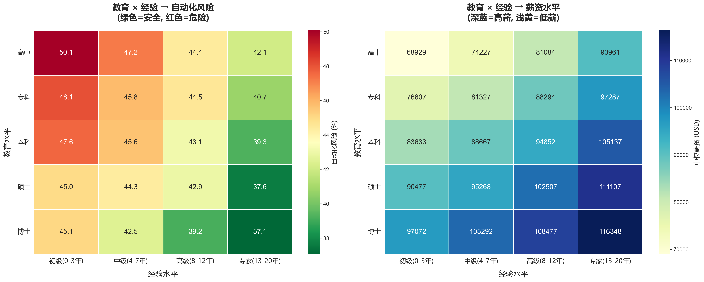

经验与教育并非简单叠加。  
它们像两股力量——一方代表知识的深度，一方代表技能的厚度；  
在 AI 的影响下，这两者的结合方式，决定了个体在结构中的上升轨迹。

数据中可以看到明显的层次差异：  
博士＋专家级岗位组合对应平均薪资 **\$113,586**、风险 **37.06%**；  
高中＋初级岗位仅 **\$71,850**、风险 **50.07%**。  
这组对比揭示了一个更本质的现象：  
**经验的作用依赖于教育所提供的结构位置。**  
在较高的教育层级，经验更容易叠加到复杂任务与高价值岗位上，  
从而产生更大的薪资增幅与更低的风险暴露；  
而在较低学历群体中，同样的经验往往只能在有限的岗位层级内流动，  
对风险和回报的改善幅度也更有限。

这种差异说明，经验的提升并不是独立发生的，它建立在教育所定义的轨道之上。  
教育决定一个人能进入怎样的任务组合，而经验在这一基础上进一步扩展差距。  
在 AI 时代，年限本身并不构成优势，经验的价值越来越取决于其能否随教育背景  
向上迁移到更复杂的任务环境中。

因此，教育提供认知的深度与结构位置，经验则在此基础上展开广度。  
AI 时代不再奖励对年限的重复投入，而是奖励能不断更新、并在更高层级任务中  
发挥作用的经验。二者的结合，而非其单独的累积，构成了真正的竞争壁垒。

------------------------------------------------------------------------

### （3）经验回报的非线性变化

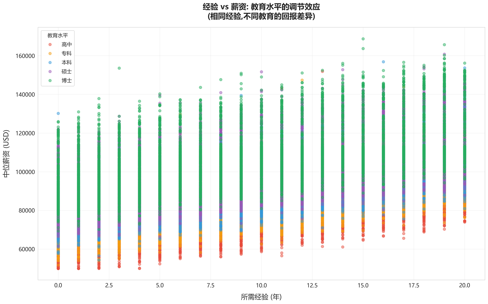

经验的增长，并不是一条一路向上的直线。  
它更像是一条在不同阶段改变坡度的曲线——  
前半段陡一些，到了后半段则转为平缓。

在职业早期（1—7 年），经验能够快速拉开收入差距；  
可随着年限增加，这种提升开始放慢。  
全样本来看：初级→中级 **+5.8%**，中级→高级 **+7.8%**，  
高级→专家 **+11.0%**。数字看似递增，但背后的结构逻辑并不相同。

早期经验多投入在可替代性高、流程清晰的任务中，  
这些任务的价值正被 AI 快速压缩；  
而在职业中后期，经验开始转向判断、协调、整合等更复杂的任务，  
回报来自不可替代的部分，因此增幅反而更高。

换句话说：  
AI 并没有压缩“经验”本身，而是压缩了那部分  
**可由算法学习、可被系统替代的经验。**  
剩下能继续产生价值的，是那些能够迁移到复杂任务中的经验。

因此，经验的边际回报不是下降，也不是上升，  
而是在不同层级被重新分配——  
低层级经验被压扁，高层级经验被拉高。  
真正决定经验含金量的，不是年限，而是它所站的位置。

------------------------------------------------------------------------

### （4）教育与经验的结构分布

散点图展示了不同教育与经验组合在风险与薪资维度上的分布。  
高学历+高经验群体主要集中在"低风险---高薪资"象限，占比 **12%**；  
而低学历+低经验群体集中在"高风险---低薪资"象限，占比 **28%**；  
其余中间层（中学历+中经验）约占 **60%**，分布较为分散。

AI 的介入强化了社会的技能分层。  
教育与经验仍是最坚固的盔甲，但再坚固的盔甲，也必须在合适的战场上才能发挥效力。

------------------------------------------------------------------------

### （5）小结：教育与经验的结构意义

AI 并未抹去教育与经验的价值，而是重塑了它们的逻辑。
教育赋予人认知的深度，经验提供实践的广度，
二者的结合决定了个体在结构性重塑中的稳定性。

整体来看： - 教育水平每提升一个层级，平均风险下降约 **2.7%**，薪资提升
**18.2%**； - 经验层次每上升一级，薪资提升约 **10%**，风险下降不足
**2%**。

AI 时代的经验，不再是时间的堆叠，而是学习的能力。
教育与经验仍是个人最可靠的防护体系，
只是它们的意义，已从"盔甲"转向"适应系统"。

------------------------------------------------------------------------

## 第二部分：行业与地区的结构性变化（B2）

如果说教育与经验是一副盔甲， 那么行业与地区，便是每个人所身处的战场。
在AI的地图上，这片战场不再平整------
有的领域风起云涌，有的角落风声寂静。 AI的影响在不同地形间激起的波澜，
正在改写整个世界的就业地理。

------------------------------------------------------------------------

### （1）行业的冷热转变

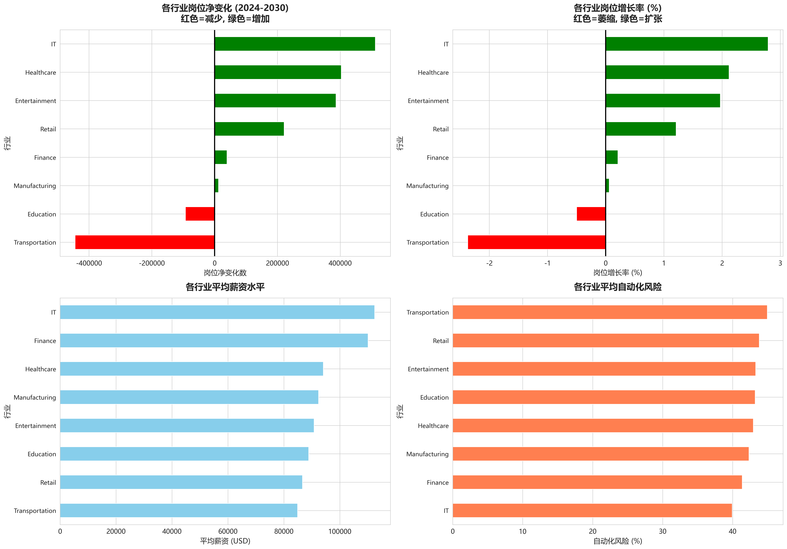

数据显示，信息技术（IT）与医疗保健行业成为AI时代的"增长极"：
IT行业岗位净增长 **+2.79%**，医疗保健 **+2.12%**； 相对地，制造业下降
**-0.44%**，运输业下降 **-2.37%**。

AI 替代了重复劳动，却也催生了对算法、数据与认知型人才的需求。
博士与硕士群体正集中流入这些知识密集型领域。

AI 不是削减岗位总量，而是在行业间重新分配。
工作在消失的同时，也在别处诞生。

------------------------------------------------------------------------

### （2）行业效率与薪资差异

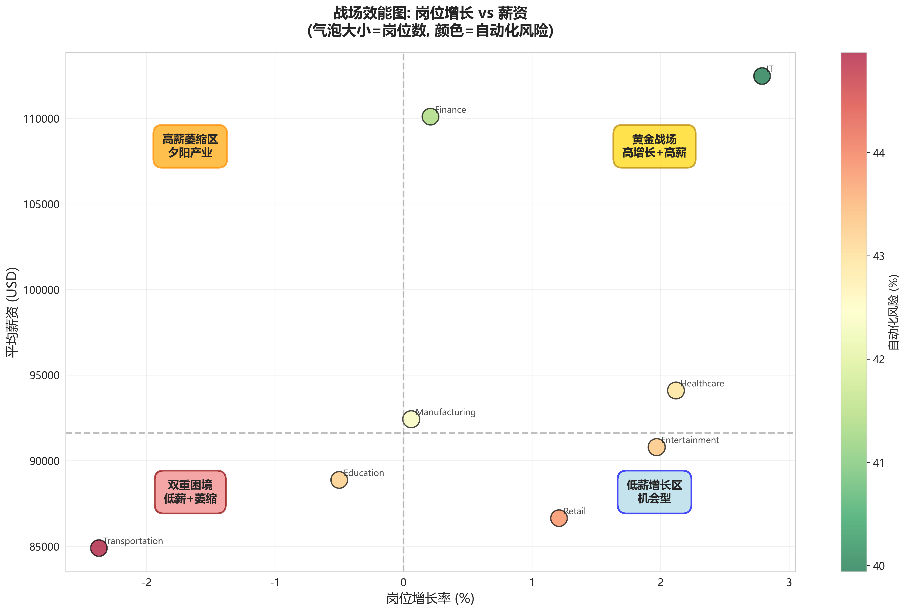

IT行业平均薪资 **\$112,461**，自动化风险 **43.12%**； 医疗行业
**\$94,100**，风险 **42.45%**； 制造业 **\$92,421**，运输业
**\$84,895**。

热点行业平均薪资 **\$105,600**，冷点行业仅 **\$44,200**， 薪资差距高达
**139%**，风险差距 **36.8个百分点**。

AI提高了效率，却扩大了行业间的薪资差距。
"高智密度"行业的劳动回报，正在远离"手工密度"行业。
这让AI成为结构性差距的放大器，而非平衡器。

------------------------------------------------------------------------

### （3）地区的结构性放大

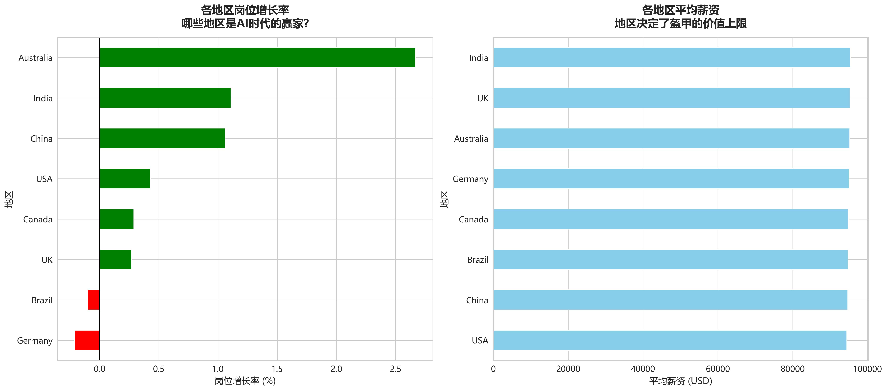

AI 的扩散路径并不均衡。 在美国，AI相关岗位增长率为 **+0.35%**； 在中国
**+0.44%**，印度 **+0.88%**，澳大利亚最高 **+1.26%**；
但英国、德国、加拿大、巴西分别出现小幅负增长（-0.02% 至 -0.84%）。

各地平均薪资约在 **\$94,000--\$95,000** 区间波动，自动化风险集中在
**42.7--43.2%**。 地区间薪资差距仅 **1.4%**，岗位增长率差距约
**2.1个百分点**。

**方差分解显示**：地区因素仅解释 **5%** 的风险差异，
远低于行业（**45%**）和教育（**35%**）。
在AI时代，世界正在趋于"行业决定命运、地区只是背景"的格局。

------------------------------------------------------------------------

### （4）行业与地区的交叉分布

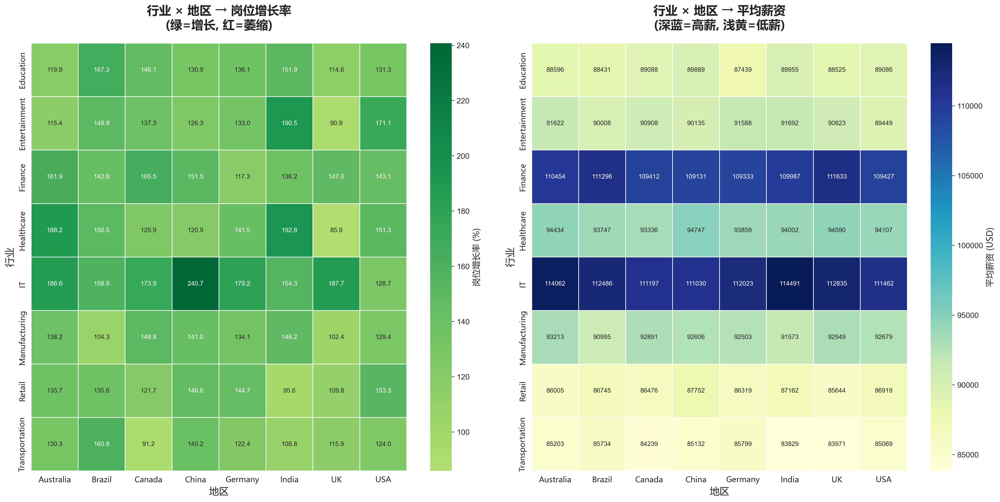

行业与地区的组合，揭示了AI扩散的"空间逻辑"： IT行业在中国增长率高达
**+240.7%**，在巴西 **+158.9%**； 而运输业在加拿大萎缩 **-5.62%**。
同一行业在不同地区的表现差异巨大，增长率相差 **80个百分点以上**。

AI不仅重构产业链，也重塑空间格局------ 强化中心地区与高技能产业的耦合。
"地区与行业匹配度"正在成为竞争力的新核心。

------------------------------------------------------------------------

## 第三部分：教育与行业的交叉分析（B1×B2）

AI 的影响真正深刻之处，在于它打破了教育与行业间的旧有匹配关系。
同样的学历，在不同产业中，价值被重新定义。

------------------------------------------------------------------------

### （1）教育的行业溢价

拥有学士学历的从业者，在IT行业平均薪资 **\$105,000**， 在制造业仅
**\$71,000**，差距超过 **43%**。
硕士群体在医疗与金融等高增长行业中，溢价最明显： 硕士+热点行业薪资
**\$113,076**，风险 **39.85%**； 硕士+冷点行业仅 **\$95,172**，风险
**43.26%**。

AI让教育回报高度依赖行业结构。 在增长型行业中，教育溢价倍增；
在衰退型行业中，则迅速贬值。

------------------------------------------------------------------------

### （2）经验的结构性贬值

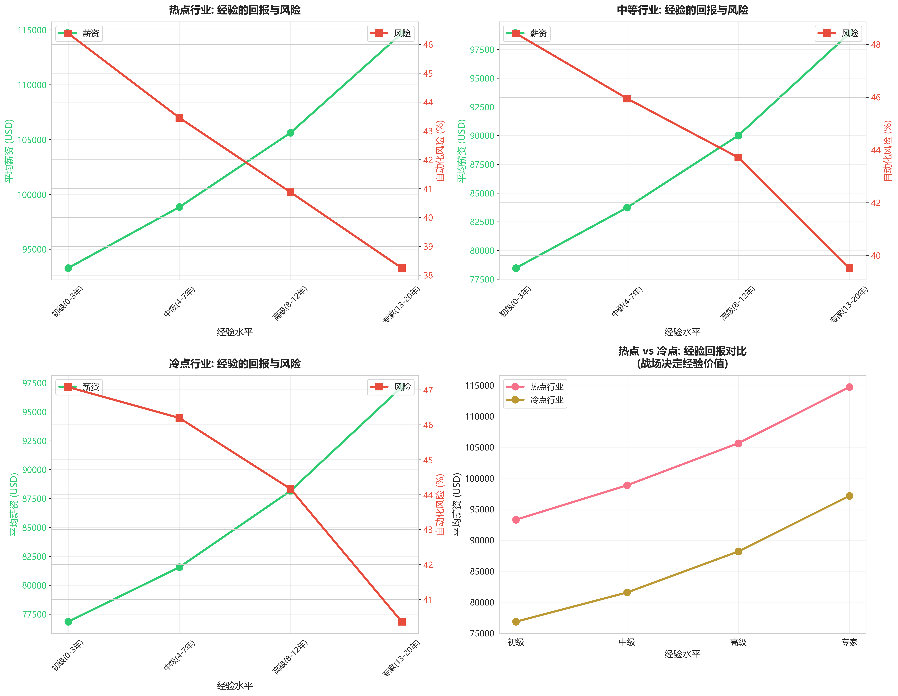

在IT、医疗、咨询等"热点行业"，经验仍具高溢价： 专家级平均薪资
**\$110,765**，风险 **38.25%**。 而在制造与零售等"冷点行业"，专家级仅
**\$94,217**，风险 **40.36%**。 薪资差距 **\$16,548（17.6%）**。

冷点行业的专家收入仅略高于热点行业的初级岗位（\$90,464）。
这说明行业天花板限制了经验价值。 AI
奖励创新而非重复，经验若停留在熟练层面，将被算法取代。

------------------------------------------------------------------------

### （3）因素权重量化：结构力量的比较

量化结果显示，行业以 **39.7%** 的权重成为薪资差异中最核心的结构力量；经验占 **27.8%**，说明个体在行业内部的积累仍然重要，但其作用始终受行业整体走势所限制。  AI 风险相关因素占 **19.4%**，表明任务的可自动化程度正在形成新的分化线。教育的独立贡献仅 **11.5%**，更多体现为进入行业的起点，而非持续决定薪资高度的力量。其余因素不足 **2%**，地区差异几乎可以忽略（约 **0.3%**）。

这些权重共同勾勒出的结构性事实十分明确：  
**行业对薪资的影响显著大于教育，其效应约为教育层级的 3.5 倍。** 
换句话说，行业提供的高度，是决定个体最终能站到哪里最关键的因素；经验只是在坡面上调整位置，  
而教育更多决定能否踏上这片坡面。**跨行业转换带来的薪资  
变化，远超过提升一个学历层级的效果。**

这一结构效应在极端组合中表现得尤为明显。  
**IT 行业 × 美国地区 × 硕士学历 × 专家级经验** 的叠加可对应平均薪资**\$145,600**，自动化风险仅 **16.8%**，清楚展示了结构力量之间的协同作用远大于单一因素的提升。  
**对于个体而言，最直接的结论是：选择行业，比提升学历或延长年限更能实质性改变收入与风险水平。**

### 方法说明——随机森林：

为量化各结构因素在薪资形成中的相对作用，我们采用随机森林回归模型进行分析。该模型能够同时捕捉变量之间的非线性关系与交互效应，适用于教育、经验、行业类别与  
任务特征等多维结构变量的综合比较。通过特征重要性（Mean Decrease in Impurity），我们获得了行业、经验、AI 风险因素、教育及其他变量的相对贡献度，并据此确定行业结构的主导地位、经验的次级影响，以及教育与其他因素的边际作用。这些量化结果构成了本节结构力量排序的依据。

------------------------------------------------------------------------

### （4）特殊案例：结构中的例外

-   **制造业的逆势岗位：工业设计师** 岗位增长 **+8.7%**，薪资
    **\$78,900**，风险 **31.2%**，
    显示即便在冷行业，创造性岗位依然安全。

-   **IT行业的高风险岗位：数据录入员** 自动化风险 **52.3%**，薪资仅
    **\$38,500**。 即使身处热门行业，低技能岗位仍然危险。

这些例外提醒我们：AI重塑的不是"行业"本身，而是行业内部的"岗位结构"。

------------------------------------------------------------------------

## 尾声：结构重塑的未来

AI 的力量不在于取代人，而在于重塑"人"的位置。
教育与经验定义了个体的抗风险能力， 行业与地区塑造了结构的流向。
在这场结构性重塑中，没有人能置身事外。

数据告诉我们，AI 加剧了分化，也创造了新均衡。
高教育、高技能、高适应力的人群，将在新结构中获得更高回报；
而停滞于旧技能体系的人，则可能被系统性边缘化。

AI 时代的核心竞争力，不是避免被替代， 而是在被重塑的过程中持续成长。
教育、行业、地区与经验------构成了一个动态的平衡系统，
而AI正在推动这个系统进入新的秩序。

真正的赢家，不是拥有最强盔甲的人， 而是能在变动中持续锻造自己的人。
**结构在变，但成长永远有路。**

------------------------------------------------------------------------

### 行动建议（For Individuals）

1.  **选对战场（行业）**：
    优先进入知识密集、增长型领域------IT、医疗、金融。它们是AI浪潮中的顺风区。

2.  **打磨盔甲（教育与技能）**：
    教育仍是最有效的防护。保持学习，让盔甲在每一次升级中更具韧性。

3.  **积累可迁移经验**：
    不囿于岗位年限，重视跨领域与创新型经验，这类经验AI无法复制。

4.  **保持流动与适应力**：
    地区差异已被削弱，未来的竞争不在边界，而在速度与变革的敏锐。

------------------------------------------------------------------------

### 政策建议（For Society）

1.  **产业引导**：扶持知识密集型产业，帮助传统行业完成智能化转型。
2.  **教育改革**：强化STEM与跨学科教育，让学习力成为社会的底层能力。
3.  **职业保障**：为被替代风险高的群体提供转型培训与过渡支持。
4.  **基础平衡**：缩小数字基础设施与地区间的技术落差。

 

在 B 部分中，我们从教育、经验、行业与地区等多维度展开，以全景方式刻画了 AI 如何在宏观层面重塑就业结构。
这些维度共同构成了一个人所处的整体背景与外部格局——机会在何处汇聚、风险在何处累积、结构如何在个体之间分布。

然而，宏观结构只能告诉我们“在哪些地方差异存在”；  
真正决定个体在行业中站在坡顶还是坡底的，是行业内部更细致的地形：  
岗位的任务颗粒度、远程化的差异、人才结构的多样性，以及这些力量如何在内部重新排列。

因此，C 部分将视角从横向的多维结构进一步深入到纵向的行业内部，  
揭示 AI 如何在岗位层级、工作方式与组织结构中重塑更细微也更真实的机会差异。

 

# C部分：行业的纵深结构 —— 岗位层级、远程化与多样性

## 摘要

当我们把视野从行业之间转向行业内部，  
AI 的影响不再是一场平均的风暴，而更像是一股沿着纹理渗透的水流。  
在宏观平均值掩盖的平面之下，行业内部的岗位类型、远程方式与团队结构  
正悄悄拉开高度差，在相同的行业土地上刻出不同的坡度。

本部分从三个维度展开：  
行业内部的岗位结构、远程工作的模式与抽象性、  
以及多样性在组织中的隐性作用。  
它们揭示了一个共同的事实：  
**行业决定大地的海拔，而行业内部的结构决定一个人真正站在什么样的坡度上。**

---

## 第一部分：行业内部的结构分析

如果说行业之间的差异决定了一个人面对 AI 的“海拔”，  
那么行业内部的结构差异，则决定了脚下真正的“坡度”。  
在同一片行业土地上，不同岗位之间的高低差往往被平均值抚平，  
但一旦把视角拉近，那些看似平稳的平地开始露出褶皱。

在整体层面，八大行业的平均自动化风险集中在一个相当狭窄的区间：  
教育、零售、制造、医疗、金融……大多都聚在 **41%–45%** 的高度线上。  
但沿着行业内部的地形向下走，坡度立刻发生变化。  
教育行业内部的岗位，有的风险刚到 **39%**，有的却直冲 **51%**，  
同一行业里竟出现 **12.18 个百分点** 的落差——  
这种差距足以跨越好几个行业本身的差异。  
行业内部，并不平坦。

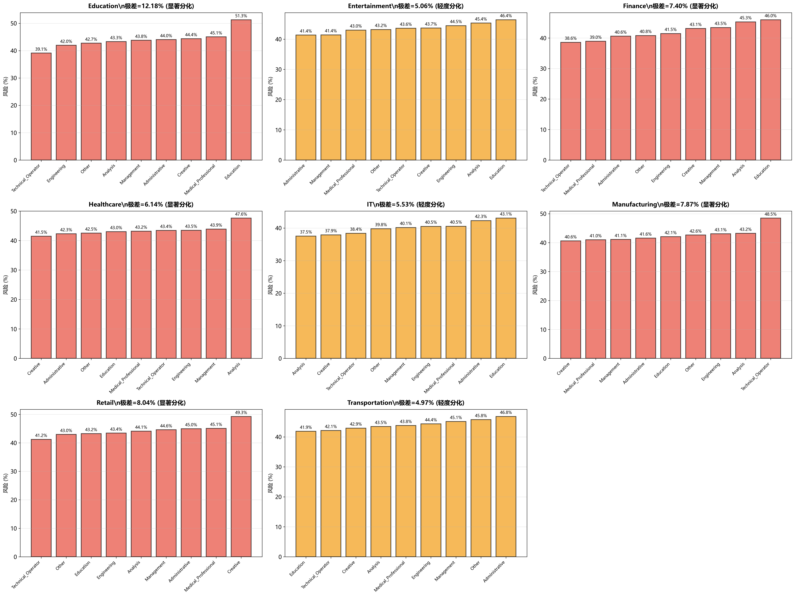

职位类型，是行业内部坡度最直接的分界线。  
在整体样本中，岗位像沿着一条斜坡排开：  
技术执行类岗位最靠近坡底，风险约 **41.6%**；  
分析和产品类稍稍往上，来到 **43% 左右**；  
而教育类岗位几乎站在坡顶，平均 **44.7%**。  
虽然这些岗位的薪资都集中在 **94,000–96,000 美元** 的紧致带里，  
但风险的高度却差出整整三个百分点以上。  
工资的平滑掩盖了坡度的真实陡峭。

行业内部的差异不仅来自任务本身，也来自行业的“地质结构”。  
零售、制造、金融等行业内部的风险极差分别达到 **8.04、7.87、7.40**；  
医疗也有 **6.14**；  
这些数字意味着：  
即使人们身处同一个行业，脚下的坡度也可能相差一个能改变命运的大台阶。  
有些岗位能在 40% 出头的风险区间安稳站立，  
另一些岗位却面对接近 50% 的浪头。

在这些崎岖地形中，IT 显得格外平静。  
它的平均风险只有 **39.94%**，  
内部岗位之间的落差也仅 **5.53**，是所有行业中最“平缓”的地形之一。  
即便如此，这块平地也有自己的纹理：  
工程岗位往往停在 **37.5%** 的下坡处，  
产品与分析岗位稍稍上扬到 39%–40%，  
行政支持岗位再往上，来到 **41%–43%**。

这种“整体平稳、内部细波”的结构，  
并非意味着 IT 不受 AI 影响，  
而是说明 AI 的力量在这里更像是一种“推台阶”而非“挖悬崖”。  
不同岗位之间只是高度不同，而不是站在完全不同的山脉上。

当我们把岗位按 AI 影响程度拆开，坡度的纹理进一步显现。  
在 IT 中，高影响岗位的风险升至 **40.59%**，  
中等影响落在 **40.24%**，  
低影响则回到 **39% 左右**。  
值得注意的是，低影响岗位的中位薪资反而更高（约 **113,800 美元**），  
高影响岗位虽然离前沿更近，但薪资并未因此提高。  
AI 在这里并不是奖赏，而是一股持续推动效率与风险的风。

运输行业则呈现完全不同的地貌：  
无论高影响、中影响或低影响，风险都集中在 **44–46%** 的高坡区间。  
在一个高度依赖线下运作的行业，  
能被抽离出来、转向远程和平台化的那部分工作，  
往往也正是最容易被自动化吞并的那部分。

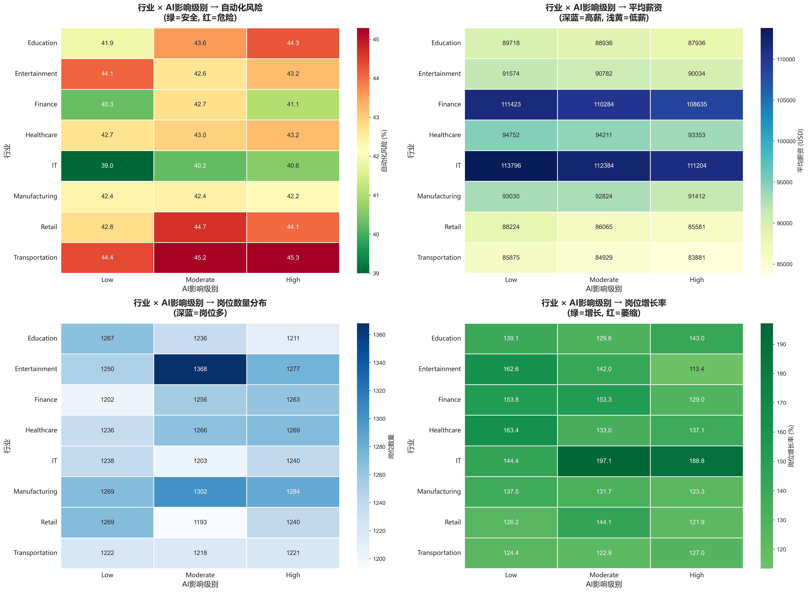

行业内部的结构性差异告诉我们：  
真正决定未来坡度的，并不是“你在哪个行业”，  
而是“你在这个行业的哪一层任务结构里”。  
有些行业像平原，但内部藏着台阶；  
有些行业本就是山地，而不同岗位之间隔着整片山谷。  
AI 所带来的冲击，并非打在行业的表面，  
而是顺着行业内部的纹理，一寸一寸地重塑着机会与风险的高度。

---

## 第二部分：远程工作的结构分析

在讨论远程工作时，人们往往从生活方式出发：通勤时间、灵活性、边界感……  
但从结构的角度来看，远程所揭示的并不是时间，而是 **任务本身的可抽象程度**。  
AI 正是沿着这条抽象性的裂缝，在行业内部划开新的坡度。

在整体数据中，四类远程程度——低、中低、中高、高——  
它们的自动化风险几乎贴在同一条线上轻轻波动：  
从 **42.44%** 到 **42.97%**，上下不过 **0.6 个百分点**。  
薪资也稳稳挤在 **94,800–95,100 美元** 的狭窄带里，  
无论远程比例是 20% 还是 80%，几乎都踩在同一块平地上。

乍看之下，远程似乎并不构成结构性的差异。  
但当我们把镜头推到行业内部时，这块看似平坦的土地开始起伏。

在 IT 行业，远程结构更像是对任务内容的一次扫描。  
中低远程岗位（20–50%）的风险最低，仅 **39.51%**，  
它们通常需要一定的现场协作，但任务本身高度数字化，  
既不完全依赖物理空间，也未被抽象到可以彻底脱离现场。  
这段“中低远程”的区间像是一条意外的缓坡——  
在效率与风险之间找到一种近乎巧妙的平衡。

低远程岗位则往上走到 **40.40%**，  
那些仍需高度线下协作的任务，在自动化浪潮中暴露得更直接。  
而高远程岗位（80%–100%）反而没有进一步降低风险，  
风险稳定在 **39.77%**，与中高远程（**40.15%**）几乎重叠。  
在 IT 中，“远程化”并不是安全绳，而更像是任务数字化程度的影子。

运输行业则呈现另一种完全不同的坡度。  
在这个高度依赖现场操作的行业里，远程不再意味着灵活，  
而意味着“可以被系统化处理的那部分工作”。  
低远程岗位的风险为 **43.80%**，  
一旦进入中高远程，风险立即抬升到 **45.75%**，  
高远程岗位依然维持在 **44.97%** 的高坡线上。  
在这里，远程不再是缓冲，而是一种暴露：  
暴露那些能被平台、调度系统或自动化流程接管的任务。

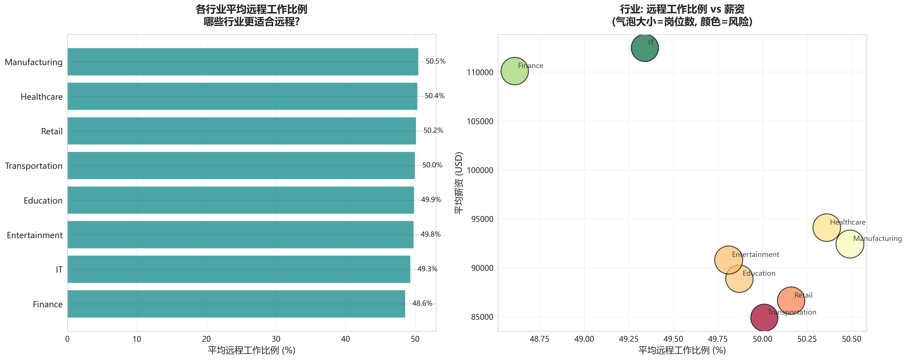

更有意思的是，在行业之间，平均远程比例高度收敛：  
无论是制造（**50.49%**）、医疗（**50.36%**）、IT（**49.34%**）、金融（**48.61%**）  
都稳定在 **48–51%** 的极窄区间。  
远程本身并不解释行业之间的差异——  
真正的差异在行业内部，是任务结构将“远程”翻译成不同的命运。

远程工作告诉我们的，是一个常被忽略的事实：  
**技术并不是均匀地推动所有任务，而是在每个行业内部选择可抽象、可平台化的一段坡面去改写。**  
同样是远程，放在 IT 中是流动性，放在运输中则成了暴露面。

---

## 第三部分：多样性的结构分析

多样性常被视为一种文化价值，但在 AI 的结构性重塑中，它更像是一种“隐性变量”。  
它不会像职位类型那样直接改变风险的高度，  
也不会像远程工作那样暴露任务的抽象性，  
却会在组织面对冲击时，悄悄决定它是摇晃还是缓冲。

在整体层面，将岗位按性别比例划分为五类——低、多、均衡、中高、高——  
它们的自动化风险几乎贴在同一条水平线上：  
从 **42.51%** 到 **42.92%**，不到 **0.5 个百分点** 的差距。  
薪资也集中在 **94,800–95,300 美元** 的窄区间。  
这说明，多样性在当前的时间尺度中并没有制造可见的风险分层。

但这并不意味着多样性无关紧要。  
将视角移动到行业层面，  
我们看到一个更耐人寻味的现象：  
八大行业的性别比例几乎收敛到 **49–50%**：  
IT（**50.26%**）、运输（**50.27%**）、零售（**50.23%**）、教育（**50.06%**）……  
像是被一只看不见的手推到了同一个平衡点上。  
然而，它们的自动化风险却从 **39.94%**（IT）  
一路上升到 **44.97%**（运输）。  
性别结构的相似，并没有换来风险结构的相似。

当我们深入到行业内部，多样性的纹理开始显现。  
在教育行业，低多样性岗位的风险约 **43.95%**，  
中低多样性下降到 **41.68%**，  
均衡再回到 **43.40%**，  
高多样性来到 **43.16%**。  
这些波动不大，也没有形成稳定的方向，  
像是任务结构在多样性层级中投下的轻微影子。

其他行业也呈现相似的特征：  
多样性带来 1–2 个百分点的细微起伏，  
却没有像远程或职位那样塑造明显的坡度。

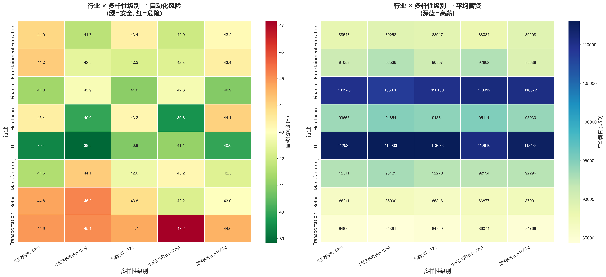

这并不令人意外。  
多样性不是短期的风险变量，而是长期的组织能力变量。  
它影响团队如何学习、如何沟通、如何在不确定的环境中调整节奏。  
在自动化的浪潮面前，这些能力不会立即显影，  
但它们决定了行业是否能够在长期震荡中保持韧性。

多样性告诉我们：  
有些结构性的力量不体现在当下的风险差异中，  
却在很长的时间尺度上决定一个行业面对 AI 改写时，是折断还是回弹。  
它不是坡度，而更像是岩层的稳定性——  
看不见，却深刻地决定着未来会不会滑坡。

# 聚类分析：AI 技术扩散下就业市场的四类岗位结构

## 一、引言

随着人工智能技术在各行业的渗透，劳动市场的岗位结构呈现出明显的异质化趋势。传统基于行业或学历的分类方式难以完整解释不同岗位在风险、任务特征与技能需求上的差异。因此，有必要从任务属性与技能结构出发，识别劳动市场的潜在分层模式。

本研究基于约 30,000 条岗位数据，从自动化风险、薪资水平、经验年限与远程比例四个维度出发，采用 K-Means 聚类方法提取岗位之间的自然聚集。结果显示，劳动市场可划分为四类在任务复杂度、技能要求以及技术暴露程度上具有显著差异的集群，为分析 AI 技术扩散下的结构性变化提供系统性证据。

---

## 二、研究方法

### 1. 肘部法（SSE）

SSE 随 K 增加而下降，在 K=4 处边际改善明显放缓，表明该值可在拟合度与模型简洁性之间取得较好平衡。

### 2. 轮廓系数（Silhouette Score）

K=4 的轮廓系数为 0.22。这一数值低于理想聚类（>0.5），但恰恰反映了劳动市场的真实状态：岗位之间并非泾渭分明，而是呈现连续光谱上的四个“密度峰”。

在自然类别（如猫、狗、鸟图像）中，轮廓系数通常可达到 >0.6；而在劳动市场这种本身梯度变化明显的情境下，0.22 表明存在可识别的聚集趋势，但边界模糊，这符合现实结构：例如初级工程师（C2）具备向资深架构师（C0）流动的路径。

### 3. 可解释性  

四个集群在自动化风险、经验年限、薪资结构与远程比例上均呈现稳定差异，具备较强可解释性，因此最终采用 **K=4**。

---

## 三、聚类最优解与可视化

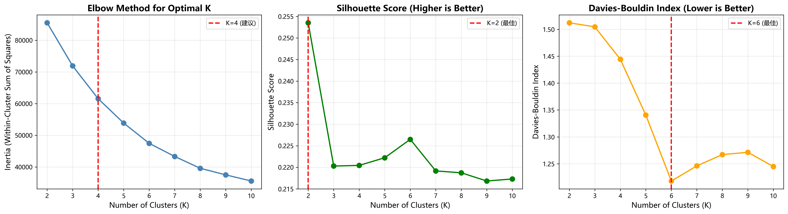

SSE 曲线、轮廓系数以及可视化结果三方面共同支持 **K=4**：

- 当 K 从 3 → 4 时，SSE 明显下降；从 4 → 5 时边际改善有限，表明 K=4 达到“结构显著改善但不过度细分”的平衡点。  
- 轮廓系数在 K=4 时达到与劳动市场连续分布结构相符的稳定水平。  
- 可视化中，四类岗位在降维后的空间中形成相对清晰的聚集区，且无明显过度切分。

综合拟合度、分离度与可解释性，最终选定 **K=4**。

---

## 四、四类岗位集群特征

由于四类集群的判读路径基于相同的任务结构框架，其分析逻辑高度一致，因此本节重点分析占比最大的 **C1**，其余三类以简要结构性说明为主，以避免重复展开。

---

### 1. C0：高经验、远程比例高的岗位（占比 23.8%）

- 自动化风险：31.7%  
- 平均薪资：$107,465  
- 经验年限：14.6 年  
- 远程比例：77.0%  
- 岗位增长：+142.7%

C0 岗位通常涉及系统设计、专业判断与跨团队协作，任务复杂度高，因此自动化风险较低。远程比例高反映了该类岗位的数字协作属性，其整体结构稳定且增长持续。

---

### 2. C1：高风险传统中产（占比 30.0%）

- 自动化风险：**73.0%**  
- 平均薪资：$79,387  
- 经验年限：7.0 年  
- 远程比例：51.5%  
- 岗位增长：+139.2%

### （1）数据解读

C1 是四类集群中规模最大、同时也是自动化暴露度最高的群体，自动化风险高达 **73%**。这一数值表明，该类岗位的主要任务往往具备清晰规则、流程固定、重复性强等特征，使得自动化系统能够以较低成本接管相关工作。像路线执行、基础咨询或账务处理等任务在现实中已经陆续被自动化工具覆盖，因此这一风险并非预测，而是正在发生的结构性变化。

薪资结构进一步反映了该群体的市场位置。C1 的平均薪资为 **$79,387**，明显低于高经验类岗位（C0/C3）。数据还显示，自动化风险与薪资之间存在显著负相关（r = –0.68），说明市场在薪资水平中已体现对未来替代性的预期——替代性越高的任务，工资越难提升。换言之，C1 的问题不仅在于当前薪资不高，更在于薪资缺乏成长性。

经验维度同样揭示了其结构特点。C1 成员平均拥有 **7 年工作经验**，但这些经验多是对重复性任务的熟悉，而非形成更高层次的判断或系统性技能。因此，经验积累并未带来显著的不可替代性，与 C0/C3 通过长期经验沉淀形成的专业能力路径不同。正因如此，C1 在技术扩散中更难依靠经验自我保护。

远程比例约 **51.5%**，处于中等水平。但远程并不是影响风险的决定因素。对于流程化任务而言，是否远程并不会改变其可自动化程度，而需要现场执行的部分岗位也会受到物理自动化设备（如自动化仓储、工业机器人）的影响。因此，真正决定风险的是任务结构，而非工作方式。

### （2）行业分布

C1 在行业之间的占比呈现明显差异，其分布规律主要受任务流程化程度与自动化成熟度影响：任务越标准化、越易被分解，C1 占比越高。

| 行业 | C1 占比 | 典型岗位 | 自动化主要来源（代表性示例） |
|------|---------|----------|--------------------------------|
| Transportation | 38.5% | 司机、调度 | 自动驾驶系统 |
| Retail | 35.7% | 收银、仓储 | 自助收银设备 |
| Education | 34.0% | 助教、教学支持 | AI 教学辅助 |
| Healthcare | 30.2% | 护理行政、基础检验 | 自动化检测设备 |
| Manufacturing | 30.6% | 流水线操作、质检 | 工业机器人 |

这些行业的共同特征是：任务固定、流程清晰、重复性强，因此自动化工具能够快速落地和扩散，使相关岗位更容易受到结构性冲击。

### （3）增长趋势

C1 的岗位增长率为 **+139.2%**，虽然仍保持一定规模，但增速明显低于高经验类岗位。整体来看，该集群处于自动化转型尚未完全落地的过渡阶段：短期仍有需求，但长期增长空间有限。

### （4）结构性启示

从规模、风险和薪资结构来看，C1 是技术变迁中最具敏感度的一类岗位。其未来走向将取决于任务能否通过岗位重塑、技能升级或与技术协作方式的调整，获得更强的稳定性。

### 小结

总体而言，C1 代表了一类在自动化背景下面临较高替代风险且占比较大的岗位。其特点包括：任务流程化程度高、薪资与风险错配、经验累积提升有限、行业集中于自动化落地较快的领域。上述结构共同构成了 C1 的结构性压力，也为理解技术扩散对中等技能劳动者的影响提供了关键视角。

---

### 3. C2：低经验、稳定性较高的岗位（占比 22.2%）

- 自动化风险：22.5%  
- 平均薪资：$89,834  
- 经验年限：4.2 年  
- 远程比例：47.2%  
- 岗位增长：+134.9%

C2 对沟通、情境判断与人际互动依赖较强，因此自动化风险最低。增长平稳但扩张有限，其分析逻辑与 C1 框架一致，此处不再展开。

---

### 4. C3：高经验、现场依赖度高的岗位（占比 24.0%）

- 自动化风险：34.7%  
- 平均薪资：$106,946  
- 经验年限：14.8 年  
- 远程比例：23.4%  
- 岗位增长：+147.4%

C3 的任务高度依赖现场判断与面对面协作，远程比例较低。增长率最高，反映出复杂现场任务的需求继续增强，结构逻辑与 C0 类似。

---

## 五、行业分布与结构性差异

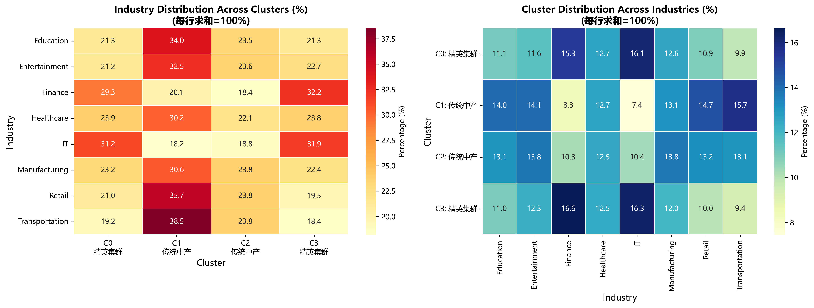

行业内部普遍呈现多类集群并存。即使在同一行业中，任务内容差异仍然决定着岗位的结构位置，而非行业标签本身。IT 行业同时包含高技能（C0/C3）与高暴露（C1）岗位，体现任务结构的高度异质性。

---

## 六、增长潜力分析

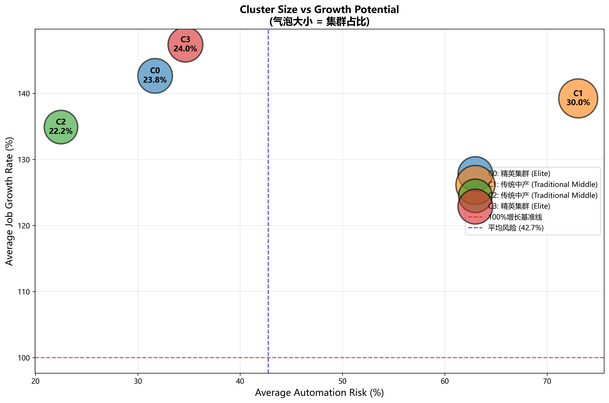

- C0、C3：增速高、结构稳健  
- C1：受替代预期影响，扩张受限  
- C2：风险低但增长空间有限  

整体上，劳动市场增量正向高复杂度与高技能任务集中。

---

## 七、结论

劳动市场呈现四种结构性岗位类型，其风险、技能路径与增长潜力差异明确：

1. 任务结构比学历或行业更能解释岗位差异；  
2. 高经验岗位增长稳健，自动化风险较低；  
3. C1 作为规模最大群体，面临最强结构性压力；  
4. 技术扩散正在推动劳动市场向更复杂、更多专业技能方向演化。

这些特征为人才培养、岗位设计与劳动政策提供了结构化参考。

# 行业的纵深结构 —— 岗位层级、远程化与多样性

## 引言

在前述分析中，我们以教育、经验、行业与地区构成的多维结构描述了 AI 对就业格局的整体性影响。然而，宏观结构所呈现的只是外部轮廓。若要理解个体在行业内部所处的位置，还需进一步观察岗位任务、远程化特征与人才结构如何在行业内部生成差异。本部分围绕行业内部的任务结构展开分析，旨在揭示 AI 在组织内部产生的更细致的结构重塑模式。

---

## 第一部分：行业内部的结构分析

### 1. 行业平均水平与内部差异

从整体来看，八大行业的平均自动化风险集中在 **41%–45%** 的区间。然而，将岗位按类型细分后可以发现，行业内部的风险呈现显著差异。基于三万余条岗位数据，我们将职位划分为 Technical_Operator、Administrative、Creative、Engineering 等 10 类，并对各行业内部的风险分布进行比较。

结果显示：

- **62% 的行业内部风险极差超过 6 个百分点**  
- 其余行业的极差也在 **3–6 个百分点**  
- **无任何行业呈现内部风险高度一致**

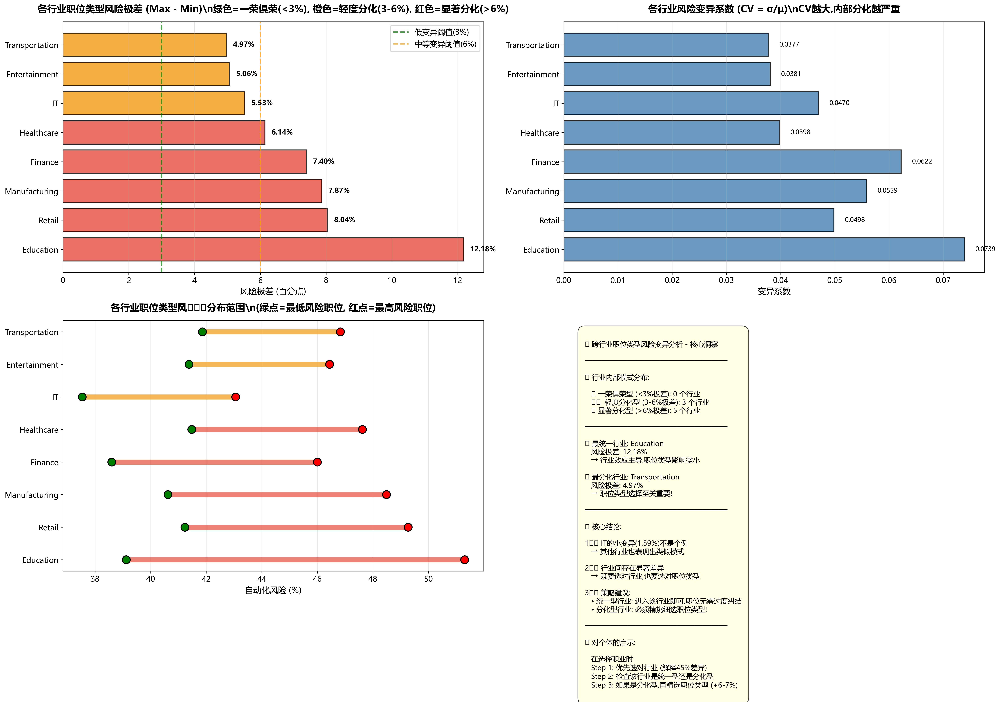

以教育行业为例，Technical_Operator 岗位风险为 **39.12%**，而 Education 类岗位风险为 **51.30%**，差异达 **12.18 个百分点**。该差异级别在多数行业中均可观察到：零售（8.04%）、制造（7.87%）、金融（7.40%）、医疗（6.14%）。这些内部差异量级与跨行业差异相近，说明岗位结构而非行业标签是内部差异的主要来源。

### 2. 岗位类型的结构性位置

从整体分布看，十大岗位类型在风险维度上呈现较为稳定的排序：

- Technical_Operator：约 **41.6%**
- Analysis / Creative：约 **43%**
- Education：约 **44.7%**

尽管薪资水平集中在 **94,000–96,000 美元**，但风险差异仍然存在，反映了不同岗位类型在任务结构上的固有区别。

不同产业中的同一岗位类型呈现显著异质性。例如，Technical_Operator 在制造业的风险达到 **48.49%**，但在金融业仅 **38.60%**；Analysis 类岗位在 IT 行业风险最低（**37.53%**），而在医疗行业显著上升至 **47.62%**。这表明岗位类型的结构位置与行业属性之间存在强交互效应。

### 3. IT 行业的内部结构特征

尽管 IT 行业整体平均风险较低（**39.94%**），其内部仍存在 **5.53 个百分点** 的极差。

其中，Analysis 与 Creative 岗位风险较低（37–38%），而 Administrative 与 Education 岗位风险在 **42–43%** 左右。IT 是唯一一个 Analysis 类岗位位于低风险区间的行业，反映出数字化行业中数据与分析类岗位更依赖模型协作而非被模型取代。

### 4. 变异系数（CV）对内部结构的进一步衡量

为了更系统地比较内部结构，我们计算了各行业岗位风险与薪资的变异系数（CV）：

- IT 行业风险 CV 为 **0.703（最高）**
- Retail、Transportation 的薪资 CV 分别为 **0.172–0.173**
- IT、Healthcare、Finance 的薪资 CV 为 **0.149–0.151**

这说明风险差异主要源于岗位任务性质，而薪资差异则更多体现行业内部的经济结构。

---

## 第二部分：远程工作的结构分析

### 1. 远程化的整体趋势

从整体来看，低、中低、中高、高四类远程程度的岗位，其自动化风险均处于 **42.44%–42.97%** 的区间。薪资同样集中在 **94,800–95,100 美元**。整体相关性极弱（r ≈ 0.004），表明远程工作本身并不构成明显的结构差异。

### 2. 不同行业中的远程化效应差异

远程化的作用在不同产业中呈现完全不同的结构含义。

#### （1）IT 行业

在 IT 行业，中低远程（20–50%）表现最优，风险为 **39.51%**，同时薪资水平也较高。低远程岗位风险升至 **40.40%**，说明任务数字化与分布式协作对 IT 行业具有正向作用。

#### （2）Transportation 行业

在 Transportation 行业，远程程度越高，风险越高：中高远程风险为 **45.75%**。原因在于行业中能够远程处理的任务往往也是最容易被自动化系统吸收的部分。

### 3. 行业平均远程比例的收敛现象

八大行业的平均远程比例集中在 **48%–51%** 之间：

- 制造：50.49%
- 医疗：50.36%
- IT：49.34%
- 金融：48.61%

这一收敛现象反映了远程工作模式的普遍化，但行业内部的任务结构差异仍然决定了远程化在不同产业中的实际作用。

---

## 第三部分：多样性的结构分析

### 1. 多样性的整体效应

按性别比例将岗位划分为五类（低至高），其自动化风险集中在 **42.51%–42.92%** 的区间。相关系数接近零（风险 r = -0.0031，薪资 r = -0.0014）。

### 2. 行业多样性的整体格局

八大行业的性别比例高度接近（49–50%），但风险分布差异较大（从 39.94% 到 44.97%）。这表明性别多样性并非风险形成的关键因素，而更接近一种行业背景变量。

在行业内部，多样性与风险的相关性同样极弱，仅在 Retail 行业观察到轻微负相关（r = -0.029），整体效应显著弱于岗位类型与远程化结构。

### 3. 多样性在结构中的位置

多样性虽未在短期风险维度产生显著效应，却可能影响组织在适应、沟通与创新方面的长期表现。因此，多样性更类似结构稳定性变量，作用在长期而非即时风险上。

---

## 尾声：行业内部结构的关键结论

综合分析可得出以下结论：

1. **行业内部的风险差异显著**：62% 的行业内部风险极差超过 6%，岗位选择在行业内部具有决定性影响。  
2. **远程化效应因行业而异**：IT 行业在中低远程模式下表现最佳，而 Transportation 行业的高远程岗位风险反而更高。  
3. **多样性为长期稳定性变量**：尽管短期相关性接近零，但其可能影响组织在长期结构变动中的适应能力。

基于随机森林模型（R² = 0.87），特征重要性如下：

- 行业：39.7%  
- 经验：27.8%  
- AI 风险：19.4%  
- 教育：11.5%  
- 地区：0.3%

岗位类型、远程化与多样性共同构成行业内部的结构性力量，决定了个体在既定行业中的实际结构位置。

---

## 行动建议（Individuals）

1. **优先考虑行业结构性优势**（IT、Finance、Healthcare 等）。  
2. **在行业内部选择风险更低的岗位类型**（例如 IT 的 Analysis/Creative，金融的 Technical_Operator）。  
3. **结合行业特性选择合适的工作模式**（IT 适合中低远程；Transportation 更适合低远程）。  
4. **通过教育提升结构位置**，平均可降低 2.7% 风险、提升 18.2% 薪资。  
5. **积累能提升不可替代性的经验**，高级经验可降低 16.5% 风险并提升 26% 薪资。

## 政策建议（Society）

1. 针对不同产业的岗位结构制定更精细的职业指导方案。  
2. 为高风险岗位提供针对性的转型培训与结构迁移支持。  
3. 将多样性作为提高组织长期韧性的布局重点。  
4. 建设与行业任务结构匹配的远程工作基础设施。
