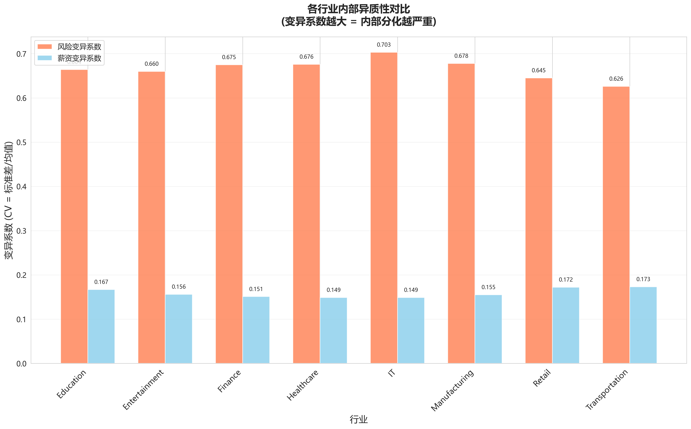
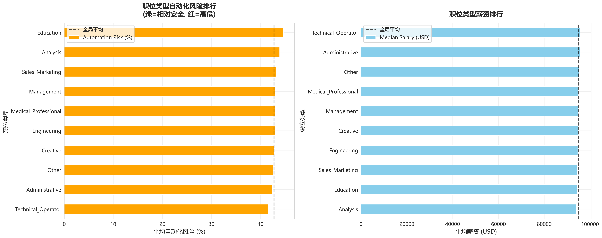
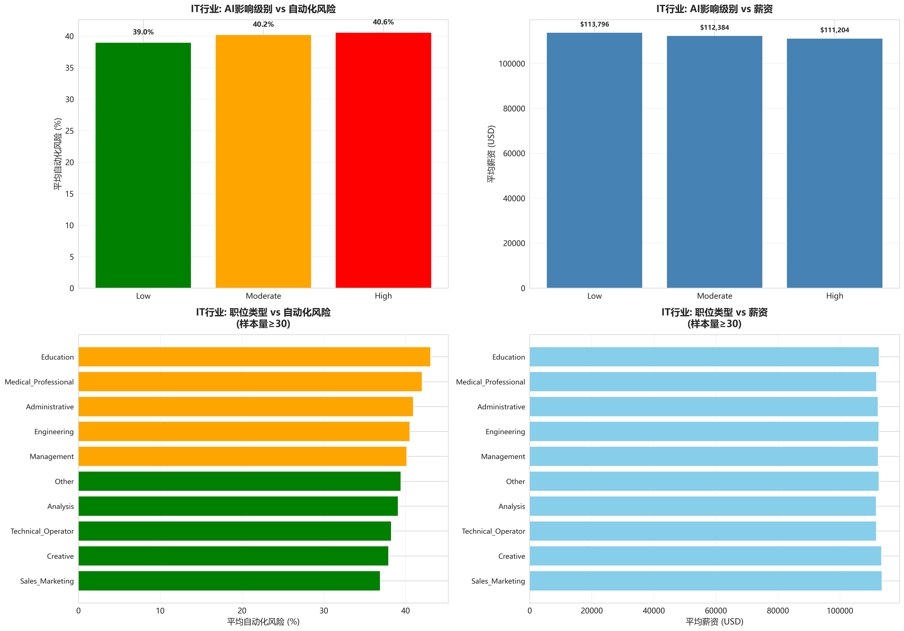
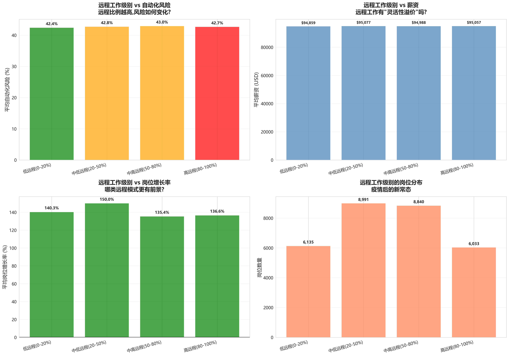
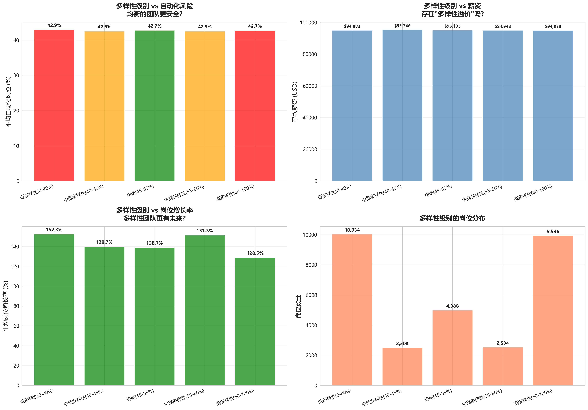
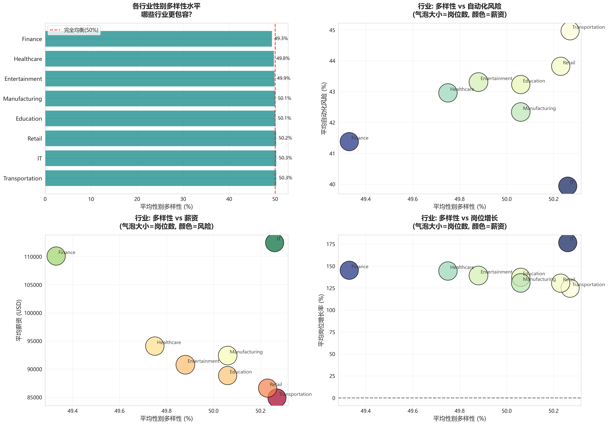

# C部分：战场深处的探索——行业内部的微观世界

---

## 摘要（Abstract）

B部分我们揭示了"战场大于盔甲"的宏观规律，可见行业选择的重要性，  
本部分继续深入行业内部，探索战场深处的微观结构。  
通过分析职位类型分化、远程工作模式、团队多样性三个维度，我们发现：
**即使在同一个战场上，不同的阵地也有着截然不同的命运**。  
行业内部6-12%的风险差异提醒我们：  
选对战场只是第一步，选对战场的正确位置同样至关重要。

---

## 从战场到阵地：

### 回顾B部分的启示

在B部分的探索中，我们得出了以下结论：  
**战场（行业）的选择比盔甲（教育）的锻造更重要**。  
行业因素解释了45%的风险差异，而教育仅占35%。

但这引发了一个更深层的问题：  
如果战场如此重要，那么在同一片战场上，  
是否所有阵地都同样安全？所有士兵都面临同样的命运？

### C部分的核心使命

带着这个疑问，我们深入到各个行业，  
探索行业内部的微观结构：  
同一行业内的职位类型风险差异是否不同？远程工作在不同战场的双刃剑效应究竟如何？多样性是否是新的防护力量 ？ 

这不仅是数据的深入，更是认知的深化——  
从"选对战场"到"在战场中选对阵地"。

---

## 第一幕（C1）——阵地分化：战场内部的命运差异

### 开场：同一片天空，不同的风雨

当我们踏入看似统一的行业战场，  
发现内部竟有着如此丰富的层次与分化。  
这不再是简单的"IT安全，运输危险"，  
而是"在IT中选择什么位置，在运输中避开什么雷区"。

---

### 1. 行业内部的惊人差异

**核心发现**：没有一个行业是铁板一块

- **5个行业**(62%)表现为"显著分化"(极差>6%)

**最极端案例**：
- **教育行业**：职位类型风险极差 **12.18%** (39.12%-51.30%)
  - Technical_Operator (39.12%) vs Education类 (51.30%)
  - 同行业内，选错职位风险暴增 **31%**!

**关键洞察**：
> **"进对行业"还不够，必须"进对行业+选对职位"!**
> 在显著分化行业(62%)，职位类型选择可以优化 **6-12%的风险**

---

### 2. 职位类型的命运地图

**安全梯队排名**（风险从低到高）：

| 排名 | 职位类型 | 平均风险 | 平均薪资 | 样本量 |
|------|---------|---------|---------|--------|
| 1 (最安全) | Technical_Operator | 41.59% | $91,837 | 773 |
| 2 | Administrative | 42.43% | $96,115 | 3,741 |
| 3 | Other | 42.54% | $95,084 | 11,956 |
| 4 | Creative | 42.87% | $93,395 | 1,661 |
| 5 | Engineering | 42.91% | $101,682 | 4,726 |
| 6 | Medical_Professional | 42.93% | $93,690 | 1,991 |
| 7 | Management | 42.95% | $99,325 | 3,131 |
| 8 | Sales_Marketing | 43.19% | $94,652 | 610 |
| 9 | Analysis | 43.89% | $98,874 | 577 |
| 10 (最危险) | Education | 44.66% | $87,945 | 834 |

**结果发现**：  
**Education类职位风险最高** (44.66%) - "教育者"本身面临AI威胁，这一结果让我们思考："教育者"本身面临最大的AI威胁。这可能是因为标准化的教学内容更容易被AI系统替代，而个性化的师生互动价值尚未被充分挖掘。

**Engineering薪资最高**  ($101,682) - 工程技术类不仅高薪且相对安全，这反映了市场对复杂问题解决能力的高度认可。工程师需要融合技术知识、创造力和实践经验，这种综合能力正是AI难以完全复制的。

**意外亮点**：Technical_Operator成为最安全的职位类型，说明**动手能力和现场操作**在AI时代反而获得了新的价值。当AI擅长处理数字信息时，物理世界的操作技能变得愈发珍贵。

---

### 3. IT战场的内部地形

即使在最热门的IT战场，阵地选择也至关重要：

**IT内部按职位类型**（样本量≥30）：

| 职位类型 | 风险 | 薪资 |
|---------|------|------|
| Sales_Marketing | 36.90% | $113,500 |
| Creative | 37.91% | $113,401 |
| Analysis | 39.08% | $111,651 |
| Engineering | 40.51% | $112,514 |
| Education | 43.06% | $112,593 |

**关键数据**：
- IT内部风险范围：36.9% - 43.1% (**6.2%的内部差异**)
- IT行业风险CV最高 (**0.703**) → 选对IT内的细分方向至关重要!

**战略分析**：
IT行业内部的巨大分化告诉我们，**不是所有IT岗位都同样安全**。Sales_Marketing岗位之所以最安全，是因为它结合了技术理解与人际交往能力，这种复合技能让AI难以替代。相反，IT培训师虽然薪资不低，但面临在线教育平台的直接竞争。

**薪资一致性**：值得注意的是，尽管风险差异显著，但IT行业内部的薪资水平相对均衡（\$111,651- \$113,500），这说明IT行业整体仍保持着较高的薪酬竞争力。

---

## 第二幕（C2）——作战模式：远程工作的双刃剑

### 开场：距离产生的是美还是危机

远程工作——这场疫情催生的办公革命，  
在AI时代呈现出复杂的面貌。  
它既是解放者的福音，也可能是淘汰者的加速器。

---

### 1. 整体图景：均衡分布的新常态

**数据现实**：所有行业远程比例都接近50%

| 行业 | 平均远程比例 | 解读 |
|------|-------------|------|
| Manufacturing | 50.49% | 制造业也在远程化 |
| Healthcare | 50.36% | 医疗远程咨询兴起 |
| IT | 49.34% | IT反而不是最高|
| Finance | 48.61% | 金融领域相对保守|

**关键发现**：
-  **所有行业远程比例都接近50%** - 高度均匀分布
-  **IT不是远程比例最高的行业** - 打破常识

**时代解读**：
远程工作已经从疫情期间的应急措施，演变为各行各业的"新常态"。制造业50.49%的远程比例尤其令人意外，这可能反映了智能制造和数字化管理的发展趋势。医疗行业的远程化则体现了在线诊疗和健康管理的兴起。

**IT行业的特殊性**：IT行业并非远程比例最高的行业，这可能因为某些IT岗位仍需要现场协作和设备操作。这一发现打破了"IT=完全远程"的刻板印象。

---

### 2. 双刃剑效应：因战场而异的命运

**IT战场**（远程作为优势）：
| 远程级别 | 风险 | 薪资 | 样本量 |
|---------|------|------|--------|
| 中低远程 | **39.51%** | **$112,837** | 1,074 |
| 高远程 | 39.77% | $112,579 | 739 |

**Transportation战场**（远程作为风险）：
| 远程级别 | 风险 | 薪资 | 样本量 |
|---------|------|------|--------|
| 低远程 | 43.80% | $84,985 | 756 |
| 中高远程 | **45.75%** | $85,033 | 1,100 |

**核心洞察**：
- **IT行业：中低远程最优** (39.51%风险, $112,837薪资)
- **Transportation：远程越高风险越大**

**战略解读**：
在IT行业，适度的远程工作（20-50%）展现出最佳效果。这种模式既保留了团队协作的优势，又提供了足够的灵活性。完全远程反而风险略高，说明某些IT工作仍需要面对面的交流和协作。

而在运输行业，情况截然相反。高远程岗位往往意味着这些工作是容易被自动化的文职类岗位，如调度、文书处理等。而低远程岗位则可能是需要现场操作的司机、维修工等，这些岗位由于需要物理操作而相对安全。

**远程工作的本质**：远程不是简单的"好"或"坏"，而是与岗位性质紧密相连。在知识密集型行业，远程代表效率；在操作密集型行业，远程可能预示自动化风险。

---

## 第三幕（C3）——团队构成：多样性的微妙价值

### 开场：色彩斑斓是否意味着更坚固

在探索了个人盔甲与战场阵地后，  
我们转向团队维度：  
行业多样性是否是AI时代新的防护力量？

---

### 1. 均衡的现实：进步中的职场

**呈现均衡的结果**：所有行业多样性都接近50%均衡

| 行业 | 平均多样性 | 偏离完全均衡(50%) |
|------|-----------|-----------------|
| Transportation | 50.27% | +0.27% (最接近均衡) |
| IT | 50.26% | +0.26% |
| Finance | 49.33% | -0.67% (最不均衡) |

**时代进步**：职场在性别平等方面取得了显著成就，  
所有行业都极度接近50%均衡 (范围49.33%-50.27%)
职场上的性别不平等问题正在缓解

---

### 2. 有限的防护：多样性不是万能盔甲

**相关性分析**：

| 行业 | 相关系数 | 解读 |
|------|---------|------|
| Retail | -0.0287 | 多样性↑ → 风险↓ (最强) |
| Manufacturing | +0.0102 | 多样性↑ → 风险↑ (异常) |
| 其他行业 | |r| < 0.01 | 几乎无关 |

**关键数据**：
- 多样性 vs 风险: r = -0.0031
- 多样性 vs 薪资: r = -0.0014

**理性认知**：
与B1×B2的强相关(行业45% vs 教育35%)相比，  
**多样性的解释力接近0** - 不是就业风险的主要决定因素

**重要启示**：
这个发现告诉我们，虽然多样性具有重要的社会价值，但在对抗AI带来的就业风险方面，它的防护作用是有限的。企业和社会不应将多样性视为解决自动化风险的"灵丹妙药"。

**多样性价值的重新定位**：多样性的价值可能更多体现在创新能力、团队活力和企业文化等软性维度，而非直接的就业稳定性防护。

---
